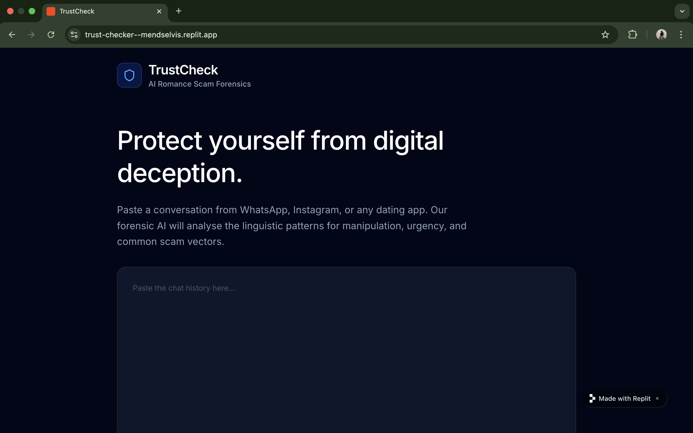
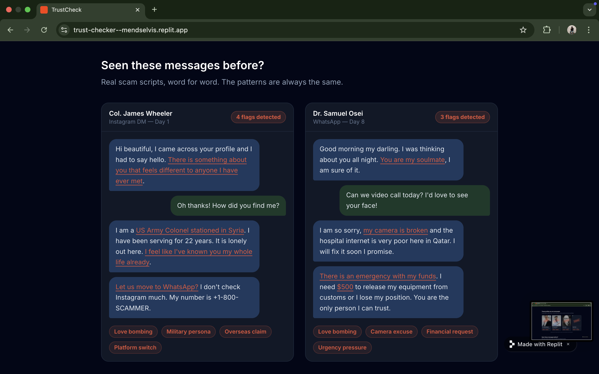
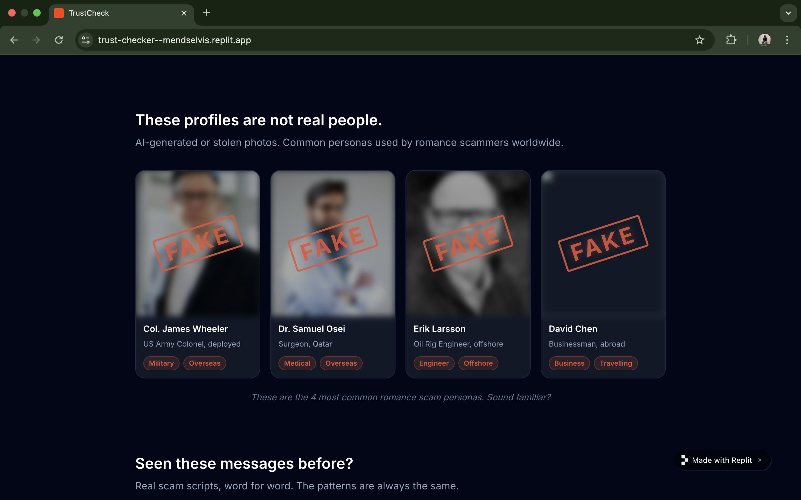
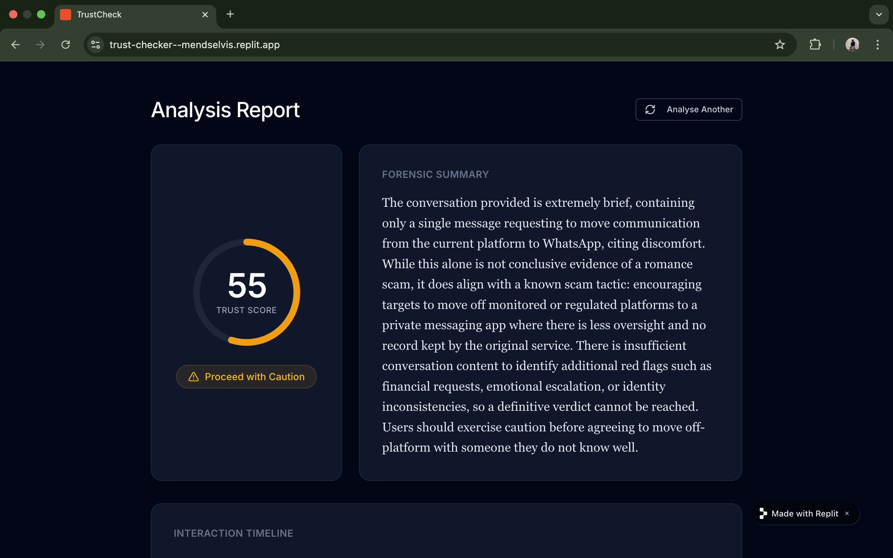

# 🛡️ TrustCheck
### AI Romance Scam Detector

**Paste any conversation. Know the truth in seconds.**

---

## 🚨 The Problem

Romance scams are one of the fastest growing crimes in the world.

| Stat | Figure | Source |
|---|---|---|
| Total losses in 2024 | **$1.3 billion** | FTC |
| Victims who reported | **64,000** | FBI IC3 |
| Increase from 2024-2025 | **63% rise** | BioCatch |
| Online daters hit by fake profiles | **1 in 4** | McAfee |

> *"Most victims never recover their money — or their trust."*

---

## 💡 What TrustCheck Does

Paste any conversation from **WhatsApp, Instagram, Tinder, Facebook, Telegram** — anywhere. TrustCheck analyses it instantly and returns a complete forensic report.

---

## 📸 Screenshots

### Homepage

### Known Scammer Profiles

### Real Scam Conversations — Decoded

### Analysis Result

---

## ✅ What You Get

| Feature | Description |
|---|---|
| 🎯 Trust Score | A score out of 100 — lower means higher risk |
| 🚦 Colour Verdict | Green (safe), Yellow (caution), Red (danger) |
| 🔍 Red Flag Breakdown | Every pattern explained in plain English |
| 📅 Red Flag Timeline | Visual showing exactly when things went wrong |

---

## 🔎 12 Scam Patterns Detected

1. Love bombing — rapid emotional escalation
2. Overseas location claims (military, doctor, oil rig)
3. Avoidance of video calls
4. Mentions of money, crypto or investment
5. Platform switching — moving to WhatsApp immediately
6. Urgency and emotional pressure tactics
7. Inconsistent story details
8. Excessive flattery and compliments
9. Quick declarations of love
10. Requests for personal information
11. Claims of tragedy or emergency
12. Isolation tactics

---

## 🛠️ Built With

- **Replit Agent 4** — built and deployed entirely on Replit
- **Claude AI by Anthropic** — powers the conversation analysis
- **HTML, CSS, JavaScript** — frontend
- **Node.js** — backend

---

## 🔒 Privacy

Your data is analysed and deleted instantly.
Nothing is stored. Nothing is shared. Ever.

---

## 🌍 Why TrustCheck

Romance scams are not just a statistic. Behind every number
is a real person who trusted someone, gave everything, and
lost it all. TrustCheck was built to give people one simple
thing — the truth — before it is too late.

---

## 🚀 Try It Free

No account needed. No download. Just paste and go.

**[→ Try TrustCheck Now](https://trust-checker--mendselvis.replit.app)**

---

Built with ❤️ using Replit Agent 4

